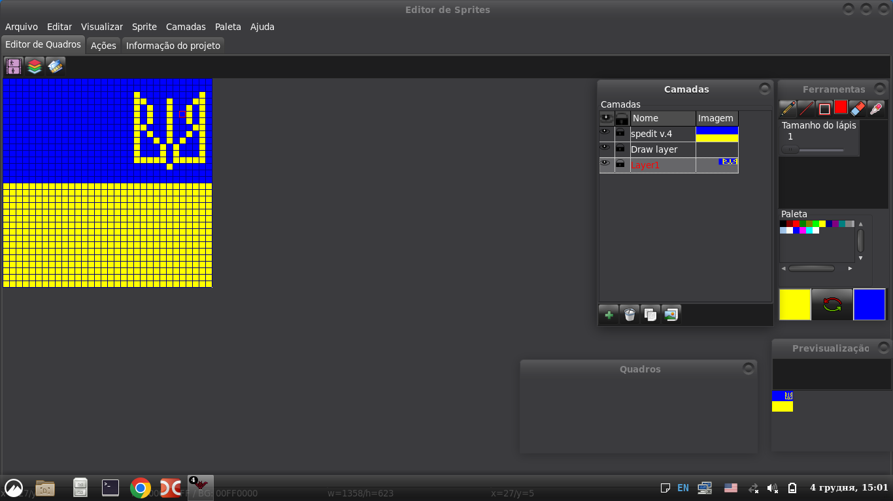

SPEdit
=======

BOAS-VINDAS
=======
Boas-vindas ao Spedit 4.0, um Editor de Pixel Art e Gerenciador de Biblioteca de Sprites gratuíto e de código aberto para Windows/Linux (talvez MacOS X também - não disponho de um Mac para teste)

INTRODUÇÃO
============
Programa escrito com Lazarus IDE/Free Pascal Compiler.
Um Editor de Sprites e Biblioteca local de sprites para jogos 2D em Pixel Art simples, mas poderoso.

COMO OBTER
===========
Quando o editor estiver pronto o suficiente para o uso (funções básicas implementadas, o programa funcionando com estabilidade), arquivos executáveis pré-compilados estarão disponíveis na área de 'Releases'.

Se você quiser compilar o SPEdit a partir do código fonte, você deve ter o Lazarus IDE com o Free Pascal Compiler instalado em seu sistema operacional (é recomendado que você use a última versão estável). A última versão estável geralmente está disponível no [site oficial](https://lazarus-ide.org). Além disso, o pacote [BGRAControls](https://github.com/bgrabitmap/bgracontrols), do qual componentes individuais são usados, deve ser instalado adicionalmente no ambiente Lazarus.
O pacote [mbColorLib](https://wiki.lazarus.freepascal.org/mbColorLib) é usado para trabalhar com a paleta de cores.

Vocẽ pode abrir o arquivo de projeto spedit.lpi no ambiente Lazarus, compilar e rodar (run) da maneira usual para esse ambiente..

TRABALHO EM PROGRESSO
=============
Continua em desenvolvimento, novos recursos seão adicionados quando eu tiver tempo e motivação suficiente.
Você pode patrocinar o criador do projeto através do https://www.buymeacoffee.com/iso4free se quiser que alguns recursos sejam priorizados.

[Junte-se ao servidor Discord do SPEdit!](https://discord.gg/7Bfjxadz)

Vocẽ também pode se juntar à discussão do projeto no [Telegram](https://t.me/+UrD_O1LO8MNlOTEy)

**Já que o País (do criador do Spedit -Ucrânia-) está em guerra e a Rússia está destruindo as instalações críticas de infraestrutura, vem ocorrendo vários e longos apagões, portanto eu não tenho a oportunidade de dedicar tempo suficiente ao desenvolvimento. Ajude a parar o agressor!**

COMO CONTRIBUIR 
=================
Antes de começar a trabalhar, por favor, abra uma questão no Github para discutir e manter o projeto com o mínimo de conflitos. Quaisquer mudanças que corrijam bugs ou adicionem funções são bem-vindas.

Sugestões / Recursos planejados:

- Documentação:
   - criar páginas WIKI e GitHub
- Desenho:
   - Modo ladrilhado
   - Opções de simetria
   - Girar e mudar camadas e quadros
   - Redimensionar/girar a seleção
- UI:
   - Linha do tempo para os quadros
   - Compositor de animação
   - Assistente de importação de Planilhas de Sprite/Ladrilho
   - Gerenciador de Projetos
   - Biblioteca local de sprites
- Outros itens
   - Importar outros formatos (.ase, .piskel etc.)

LOCALIZAÇÃO
============
SPEdit suporta a localização de sua interface para outros idiomas. Os arquivos de tradução de interface possuem o formato padrão PO (Portable Object) e devem posuir nomes no formato 'spedit.xx.po' ou 'spedit.xx_XX.po', onde 'xx' ou 'xx_XX' é o identificador de linguagem comum (ex: spedit.pt_BR.po para Português Brasileiro). Após selecionar o arquivo de tradução de interface, a localização ocorre imediatamente sem reiniciar o programa e será ativado automaticamente ao reabrir o programa.

Se voce quer que o SPEdit seja localizado para o seu idioma, você pode contribuir com a tradução [aqui](https://crwd.in/spedit).

BREVE DOCUMENTAÇÃO
===================
Use o mouse ou a sua mesa digitalizadora para desenhar.

Na janela Ferramentas selecione as cores primária e secundária, selecione a ferramenta para desenhar com o mouse e mude o tamanho do lápis. As ferramentas Lápis (P), Linha (L), Retângulo (R), Retângulo Preenchido (Shift + R), Círculo (C), Preenchimento (F), Borracha (E), Pipeta (O) e Seleção Retangular (S) estão disponíveis para desenho no momento.

Você pode selecionar as cores primária e secundária clicando em uma cor na paleta com os botões esquerdo (primeiro plano) ou direito (plano de fundo) do mouse.

Você também pode selecionar qualquer cor clicando diretamente nas cores primária e secundária com o botão esquerdo do mouse para mostrar o diálogo Cores ou definí-la como transparente clicando com o botão direito do mouse.

Para trocar as cores tecle 'X' ou clique no botão entre as cores primária e secundária (as setas verde e vermelho em arco ).

Para administrar as paletas, você pode importá-la no formato HEX (serão adicionados mais formatos no futuro) ou importar de um arquivo de imagem. Por enquanto, a paleta é limitada a somente 256 cores indexadas, Mas no futuro esses limites poderão ser cancelados.

Para redefinir a paleta para as cores padrão use o menu 'Paleta>Redefinir paleta'.

Você pode exportar a paleta no formato HEX para usá-la para qualquer propósito.

Segure Ctrl e use a rolagem do mouse (pra cima e pra baixo) para mudar o tamanho da grade.

Segure Alt e use a rolagem do mouse para mudar o tamanho do padrão em xadres do fundo.

Segure a rolagem do mouse para arrastar a área de desenho.

Clique em 'Previsualização' para exportar a imagem no formato PNG.

Para exibir uma imagem de referência selecione o menu 'Visualizar>Pinel de Ferramentas>Referência'.

Clique na janela 'Referência' para abrir qualquer imagem de referência.

Você pode adicionar, copiar e remover camadas no painel 'camadas', a camada ativa é destacada em vermelho. Também é possível alternar a visibilidade de uma camada clicando no ícone de olho ao lado do nome da camada. O ícone com cadeado te permite bloquear uma camada contra mudanças (será usado quando se compartilha camadas entre quadros diferentes). Você pode mudar o nome da camada com um clique duplo sobre o nome antigo.

Para aqueles que gostam de uma interface minimalistica e usar um maior espaço da tela para desenhar, há uma opção para mudar para o modo Tela Cheia (atalho 'F11'), assim como ocultar os painéis extras - camadas, quadros, paleta usando os botões correspondentes na barra de ferramentas.

Pressione o botão 'Criar um novo quadro' na barra de ferramentas para iniciar uma nova imagem. Uma janela vai abrir onde você debe inserir o nome, a largura, a altura do quadro e um tamanho mínimo da célula na grade de desenho (de 4 até 20). Significa que o valor mínimo a grade vai ter o zoom afastado. 

O FUTURO
==========
No futuro estarão disponíveis:
- desenho com mouse usando ferramentas de desenho diferentes (parcialmente implementado)
- multi-quadros e multi-camadas para desenho (multi-camadas implementado)
- deslocar e girar camadas e quadros
- compositor de animações de qualquer quadro (fps)
- importar outros arquivos de imagem e copiar partes delas pro arquivo sendo editado
- redimensionamento de quadro (implementado)
- exportar no seu próprio formato de arquivo JSON
- gerenciar a biblioteca local de sprites com busca por hashtags
- outros recursos que serão necessários
- localização da interface para outros idiomas (implementado)

SOLUÇÃO DE PROBLEMAS
===============
- [+] No Windows as teclas não vão funcionar. Será consertado em breve.(consertado)
- [+] Roda muito lentamente no Windows. (consertado)
- [+] As vezes ocorrem vazamentos de memória. (consertado)
- [+] A interface não funciona muito bem no Windows.(consertado)

DIREITO AUTORAL
=========

Copyright (C) 2001-atualmente Vadim Vitomsky

Este programa pode ser usado livremente e você pode distribuí-lo sob certas condições.

Este programa é distribuído na esperança de que será útil, mas SEM GARANTIA; sem mesmo a garantia implícita de COMERCIALIZAÇÃO ou ADEQUAÇÃO A UM DETERMINADO FIM. Consulte o Contrato de Licença do Spedit para obter mais detalhes.

Você deve ter recebido uma cópia GNU GENERAL PUBLIC LICENSE V.3 com este programa; veja o arquivo [LICENSE](LICENSE). Se não, visite o site do Spedit.

Compartilhe e divirta-se!

   Vadim Vitomsky
   iso4free@gmail.com

Sinta-se a vontade para entrar em contato comigo se tiver requisitos de compactação comercial ou ofertas de trabalho interessantes.

HISTÓRIA
=======

No início dos anos 2000, quando eu acabava de dar meus primeiros passos na programação com Turbo Pascal, eu queria fazer jogos.
Nessa época eu não tinha acesso à Internet, nem sequer tinha um PC!
Mas eu queria me tornar um programador profissional e continuei estudando programação de um livro.

Todos os jogos usam algum tipo de imagem e eu decidi fazer meu proprio editor de imagens a princípio 'por diversão' e praticar programação.
Primeiro eu pensei em qual funcionalidade eu poderia implementar baseado no conhecimento que eu tinha na época.
Depos disso eu pensei no conceito da interfáce gráfica do usuário que eu desenhei esquemáticamente em um caderno comum
e, no mesmo caderno, eu começei a escrever o código com uma caneta para a implementação de fragmentos individuais do futuro editor.
Já que as imagens dos personagens nos jogos se chamam 'sprites', o nome do editor foi determinado como Sprite Editor ou Spedit.
De acordo com suas capacidades, ele podia fazer muito pouco - editar um fragmento da imagem principal pixel por pixel em uma
forma ampliada. Só 16 cores eram usadas na paleta. Um formato customizado foi usado para armazenar as sprites.
 Ao iniciar, você tinha que digitar o nome do arquivo a ser editardo na linha de comando, depois disso uma tela de apresentação
 aparecia com o nome do programa e no fundo um céu noturno estrelado. Após pressionar qualquer tecla, a interface
 de usuário aparecia. Era feia e inútil, mas funcionava! E agora, infelizmente, o código fonte está perdido.

 A próxima versão foi feita um ano depois. A diferença com a versão anterior foi o suporte ao formato PCX.
 Ainda era inútil. O código e os executáveis podem ser encontrados no diretório 'archive/spedit 2.0'.

 Dois anos depois eu tentei portar o SPEDit do Turbo Pascal para Free Pascal Compiler e compilar para Windows.
 Tiveram algumas alterações no UI e suporte a paleta de 256 cores, mas sem suporte ao mouse.
 O idioma da interface foi alterado do Russo para o Inglês. E ainda era inútil.
 O código tambem está disponível do diretório 'archive/spedit 3.0'.

Daqui eu decidi criar uma versão nova do SPEDit do zero usando CodeTyphon IDE com muitas funcionalidades.
Essa versão recebe o número 4.

Mas eu estava curioso para portar o antigo código Turbo Pascal e rodá-lo no Linux e Windows modernos e decidi portá-lo.
Para a minha surpresa não foi difícil - só substituí as unidades CRT e GRAPH por ptccrt e ptcgraph e pequenas mudanças no código.
Voila! Agora ele compilava e rodava! Agora você pode rodar a versão nativa no seu sistema operacional e tentar desenhar pixel art usando somente o teclado e uma paleta de 16 cores, como nos tempos do MS-DOS.
Eu criei um formato de sprite simples (baseado em texto) na versão portada, Você pode explorar o código do antigo Spedit para a descrição.

É claro que tem codigo antigo e feio, mas funciona! E esse foi o primeiro aplicativo que eu fiz a sério. Então não me julgue tão duramente, Eu só estava aprendendo o básico de programação na época.
Mas se você for rodar o SPEdit antigo lembre-se de que você DEVE especificar o nome do arquivo de sprite na linha de comando (com ou sem qualquer extensão). Se um nome não for inserido, o arquivo será nomeado de 'test.spr' por padrão.

REGISTRO DE DESENVOLVIMENTO
=======
[Registro de Desenvolvimento](/doc/devlog_pt-BR.md)
