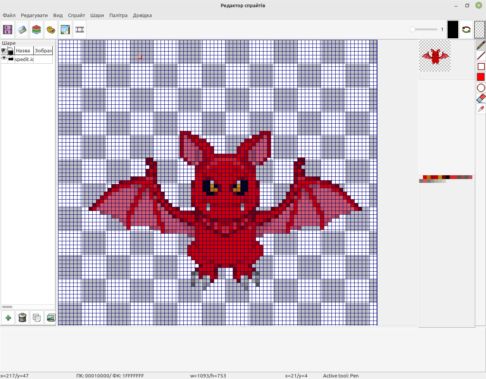

ВІТАЄМО
=======

Ласкаво просимо до Spedit 4.0, безкоштовного редактора піксель-арту та бібліотечного менеджера спрайтів для Windows/Linux (можливо також MacOS X — не можу перевірити, бо у мене немає Mac)

ВСТУП
=====

Програма написана за допомогою інструментів Lazarus IDE/Free Pascal. Простий, але (можливо) потужний редактор і бібліотечний менеджер спрайтів для 2D-ігор що, використовують графіку в стилі піксель-арт.

ЯК ОТРИМАТИ
===========

Коли редактор буде достатньо готовий для використання (будуть реалізовані основні функції, програма буде відносно стабільно працювати), попередньо скомпільовані збірки можна буде скачати у розділі Releases.

Якщо ж Ви бажаєте спробувати зібрати Spedit з сирців власноруч, необхідно мати встановленим у Вашій операційні системі інтегроване середовище розробки Lazarus з компілятором Free Pascal Compiler (бажано використовувати останні стабільні збірки). Остання стабільна версія зазвичай доступна на [офіційному сайті](https://lazarus-ide.org). Крім цього, в середовищі Lazarus необхідно додатково встановити пакунок [BGRAControls](https://github.com/bgrabitmap/bgracontrols), з якого використовуються окремі компоненти. Для роботи з палітрою кольорів використовується пакунок [mbColorLib](https://wiki.lazarus.freepascal.org/mbColorLib).

Після цього можна відкрити файл проекту spedit.lpi в середовищі Lazarus і скомпілювати й запустити звичайним для цього середовища способом.

ХІД РОБОТИ
==========

Триває розробка, нові функції будуть додані, коли у мене буде достатньо часу та мотивації. Якщо хочете пришвидшити додавання окремого функціоналу, можете спонсорувати мене через <https://www.buymeacoffee.com/iso4free>.

[Приєднуйся до SPEdit Discord Server!](https://discord.gg/JEU3ghn6W7)

Також можна приєднатись до обговорення проекту в [Telegram](https://t.me/+UrD_O1LO8MNlOTEy)

**Оскільки зараз в нашій країні триває війна і Росія знищує наші об'єкти критичної інфраструктури, через тривалі блекаути я не маю можливості виділяти достатньо часу на розробку. Допоможіть зупинити агресора!**

ЯК ЗРОБИТИ ВНЕСОК
=================

Перед початком роботи, будь ласка, відкрийте питання для обговорення, щоб ми могли організувати роботу без зайвих конфліктів. Будь-які зміни, які виправляють помилки або додають функції, вітаються.

Пропозиції / Заплановані функції:

- Документація
  - створити WIKI і Github pages
- Малювання:
  - Плитковий режим
  - Параметри симетрії
  - зсув і обертання шарів та фреймів
  - масштабування/обертання виділення
- Інтерфейс користувача:
  - Хронологія кадрів
  - Композитор анімацій
  - Майстер імпорту спрайтшітів/тайлшітів
  - Менеджер проекту
  - Локальні бібліотеки спрайтів
- Інші речі:
  - Імпорт інших форматів (.ase, .piskel тощо)

ЛОКАЛІЗАЦІЯ
===========

SPEdit підтримує локалізацію інтерфейсу на різні мови. Файли перекладу інтерфейсу мають стандартний формат PO (Portable Object) і повинні мати імена у форматі spedit.xx.po або spedit.xx_XX.po, де xx або xx_XX - загальний ідентифікатор мови (напр. spedit.uk.po - локалізація на українську мову). Після вибору файла перекладу інтерфейсу локалізація відбувається відразу без перезапуску програми і при наступному запуску буде задіюватись автоматично.

Якщо бажаєте бачити SPEdit локалізованим на Вашу мову, можете долучитись до перекладу [тут](https://crwd.in/spedit).

КОРОТКА ІНСТРУКЦІЯ
===================

Просто використовуйте мишу, як у будь-якому графічному редакторі.

У вікні інструментів виберіть основний і додатковий колір, виберіть інструмент для малювання мишею та змініть розмір пера. Наразі доступно для малювання Олівець, Лінія, Прямокутник, Заповнений прямокутник, Коло, Заливка області, Гумка, Піпетка та Прямокутне виділення. Щоб скасувати виділення, натисніть клавішу 'Esc'.

Можна обрати основний і допоміжний кольори, клацнувши будь-який колір у палітрі лівою (основний) або правою (додатковий) кнопками миші.

Також можна вибрати будь-який колір, просто клацнувши на основному або додатковому кольорі лівою кнопкою миші, або встановити як прозорий, клацнувши правою кнопкою миші.

Щоб поміняти кольори місцями, натисніть клавішу X або клацніть кнопку між основним і додатковим кольорами (з червоною та зеленою стрілками).

Щоб керувати палітрою, можна імпортувати її з файлу палітри у форматі HEX або імпортувати з файлу зображення ​​(інші формати будуть додані в майбутньому). Наразі палітра обмежена лише 256 індексованими кольорами, але в майбутньому ці обмеження можуть бути скасовані.

Щоб скинути палітру до кольорів за замовчуванням, просто скористайтеся меню «Палітра>Скинути палітру».

Можна експортувати палітру в форматі HEX для миші використання у будь-яких миші

Утримуйте клавішу Ctrl і використовуйте прокрутку миші щоб масштабувати сітку (або Ctrl+NumPlus/Ctrl+NumMinus на клавіатурі).

Утримуйте клавішу Alt і використовуйте прокрутку миші щоб змінити розмір фонової шахівниці.

Утримуйте коліщатко миші щоб пересунути область малювання (або використовуйте Shif+стрілки на клавіатурі).

Клацніть по зображенню у вікні "Попередній перегляд" щоб експортувати його у форматі PNG.

Щоб показати референсне зображення, оберіть меню "Перегляд>Панелі інструментів>Референс".

Клацніть мишкою у вікні "Референс" щоб відкрити будь-яке зображення, що використовується як референс.

В панелі роботи з шарами можна додавати, копіювати та видаляти шари, активний шар виділено червоним кольором. Також можливо переключати режим видимості шару, клацнувши по значку з оком навпроти назви шару. Значок зі замком дозволяє заблокувати шар від змін (буде використовуватись при спільному використанню шарів між різними кадрами). Подвійний клік лівою кнопкою мишки по імені шару дозволяє змінити назву шару.

Для тих, кому подобається мінімалістичний інтерфейс і використовує масимальну площу екрану для малювання, є опція переключення в режим "Дзен" (клавіша <F11>) - повноекранний режим з приховуванням усіх панелей інструментів (зручно для швидких ескізів). В звичайному режимі також можна приховати додаткові панелі - шари, фрейми, палітру з попереднім переглядом використовуючи відповідні кнопки на панелі інструментів.

Натисніть кнопку "Новий фрейм" на панелі щоб почати нове зображення. З'явиться діалогове вікно, в якому потрібно вказати назву фрейму, ширину, висоту та мінімальний розмір клітинки сітки для малювання (значення від 4 до 20). Це означає мінімальний масштаб, до якого можна зменшити сітку. Також можна відмітити галочкою "Копіювати шари" шоб отримати повну копію поточного фрейму.

Майбутнє
========

У майбутньому буде доступно:

- малювання мишою з використанням різних інструментів (виконано частково)
- мультифрейми і мультишаровість для малювання (виконано мультишаровість)
- зсув і обертання шарів і фреймів
- композитор анімації з будь-яких кадрів
- імпорт інших файлів зображень і копіювання їхніх частин до власного зображення
- зміна розмірів фрейма (виконано)
- експорт у власному форматі файла стандарту JSON
- керування локальною бібліотекою спрайтів за допомогою корисного пошуку за хештегами
- інші функції, які знадобляться
- локалізація інтерфейсу на різні мови (виконано)

ВИРІШЕННЯ ПРОБЛЕМ
=================

- [+] В ОС Windows не працюють клавіші (виправлено)
- [+] В ОС Windows дуже повільно працює (виправлено)
- [+] Періодично відбуваються витоки пам'яті (виправлено)
- [+] В ОС Windows інтерфейс працює некоректно (виправлено)

АВТОРСЬКЕ ПРАВО
===============

Авторське право (C) 2001-дотепер Вадим Вітомський

Цю програму можна використовувати вільно, і ви можете поширювати її за певних умов.

Ця програма розповсюджується в надії, що вона буде корисною, але БЕЗ ЖОДНИХ ГАРАНТІЙ; навіть без неявної гарантії ПРИДАТНОСТІ ДЛЯ ПРОДАЖУ чи ВІДПОВІДНОСТІ ДЛЯ КОНКРЕТНОЇ МЕТИ. Для отримання додаткової інформації див. Ліцензійну угоду Spedit.

Ви мали отримати копію GNU GENERAL PUBLIC LICENSE V.3 із цією програмою; дивіться файл [LICENSE](LICENSE). Якщо ні, відвідайте домашню сторінку Spedit.

Діліться та насолоджуйтесь!

   Vadim Vitomsky
   iso4free@gmail.com

Не соромтеся зв’язуватися зі мною, якщо у вас є комерційні пропозиції або цікаві пропозиції роботи.

ІСТОРІЯ
=======

На початку 2000-х коли я лише зробив перші кроки в програмуванні мовою Turbo Pascal, я хотів розробляти ігри. На той час у мене не було доступу до мережі Інтернет, я навіть не мав власного комп'ютера! Але я хотів стати професійним програмістомі продовжував вивчати програмування за допомогою підручника.

Усі ігри використовують якісь зображення, і я вирішив розробити свій власний редактор зображень спочатку просто "для розваги" і щоб попрактикуватись у програмуванні. Спочатку я думав про те, яку функціональність я міг би реалізувати на основі знань, які мав на той момент. Після цього я придумав концепцію графічного інтерфейсу користувача, яку схематично намалював у звичайному блокноті і в цьому ж блокноті почав писати ручкою код для реалізації окремих фрагментів майбутнього редактора. Оскільки зображення персонажів в іграх називаються спрайтами, назва редактора була визначена як Sprite Editor або Spedit. За своїми можливостями він міг зовсім небагато - попіксельно редагувати фрагмент основного зображення в збільшеному вигляді. Всього в палітрі було використано 16 кольорів. Для зберігання спрайтів використовувався власний формат файлу. При запуску потрібно було в командному рядку ввести назву файлу, який потрібно редагувати, після чого з'являлася заставка з назвою програми на тлі зоряного неба. Після натискання будь-якої клавіші з'являється інтерфейс користувача. Це було потворно та непрактично, але працювало! Наразі, на жаль, вихідний код було втрачено.

 Наступна версія 2.0 була зроблена через рік. Відмінністю від попередньої версії була підтримка формату файлів PCX. Це все ще було непрактично. Вихідні коди та виконуваний файл можна знайти в каталозі «spedit 2.0 turbo pascal version».

 Через два роки я спробував перенести SPEDit з Turbo Pascal на Free Pascal Compiler і скомпілювати для Windows. Були деякі зміни в інтерфейсі користувача та підтримка палітри 256 кольорів, але не підтримувалася миша. Змінено мову інтерфейсу з російської на англійську. Але це все одно було непрактичним. Вихідні коди також доступні в каталозі 'archive/spedit 3.0'.

На даний момент я вирішив створити нову версію SPEDit з нуля, використовуючи CodeTyphon IDE з великою функціональністю. Ця версія отримала номер 4.

Але мені було цікаво перенести старий код Turbo Pascal і запустити його на сучасних Linux і Windows системах, і я вирішив спробувати це зробити. На мій подив, це було не важко — я просто замінив модулі CRT і GRAPH на ptccrt і ptcgraph, а також вніс деякі незначні зміни в код для збереження зображень. Вуаля! Тепер він скомпілювався і запустився! Тож тепер можна запустити нативну версію під Вашою операційною системою та спробувати намалювати піксель-арт, використовуючи лише клавіатуру та 16 кольорів, як у дні DOS. Я створив простий формат спрайту (на основі тексту) у портованій версії. Ви можете переглянути сирці цього Spedit'а щоб прочитати опис.

Звичайно, це старий і потворний код, але він працює! І це була моя перша серйозна програма. Тож не судіть мене суворо, я тоді тільки вивчав ази програмування. Але якщо ви запускаєте цей старий SPEdit, пам’ятайте, що ви ПОВИННІ вказати ім’я файлу спрайту в командному рядку (з будь-яким розширенням або без). Якщо його не вказувати, то по замовчуванню буде використано ім'я файлу "test.spr".

Щоденники розробки
==================

[dev.log](doc/devlog.md)
