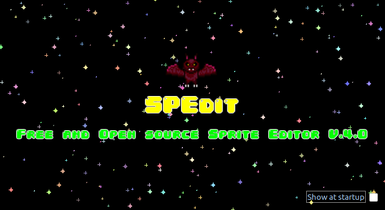
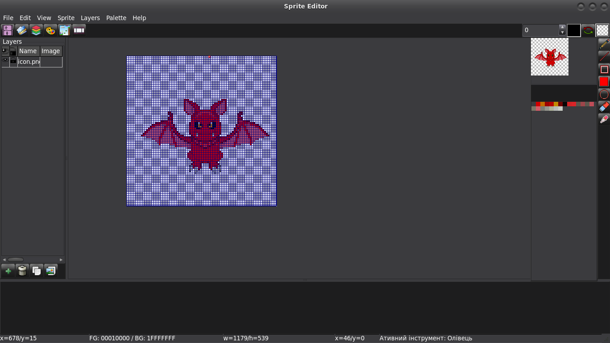
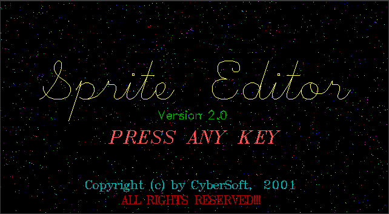
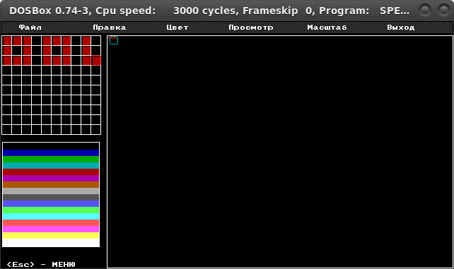
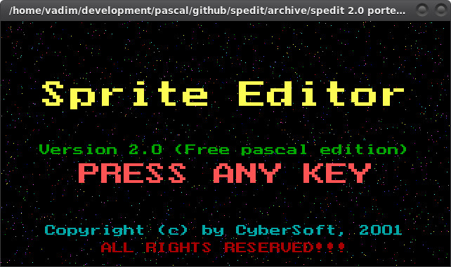
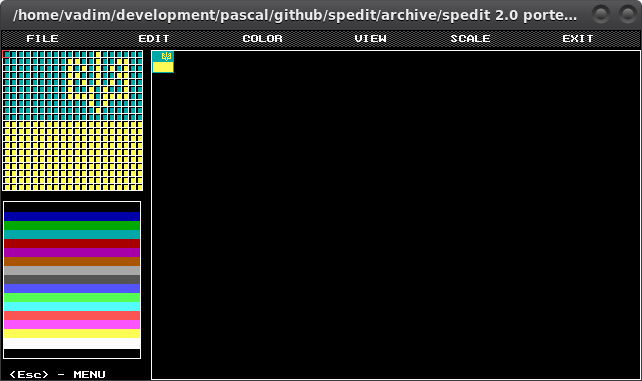

BOAS-VINDAS
=======
Boas-vindas ao Spedit 4.0, um Editor de Pixel Art e Gerenciador de Biblioteca de Sprites gratuíto e de código aberto para Windows/Linux (talvez MacOS X também - não disponho de um Mac para teste)

INTRODUÇÃO
============
Programa escrito com Lazarus IDE/Free Pascal Compiler.
Um Editor de Sprites e Biblioteca local de sprites para jogos 2D em Pixel Art simples, mas poderoso.

TRABALHO EM PROGRESSO
=============
Continua em desenvolvimento, novos recursos seão adicionados quando eu tiver tempo e motivação suficiente.
Você pode me patrocinar através do https://www.buymeacoffee.com/iso4free se quiser que alguns recursos sejam priorizados.

LOCALIZAÇÃO
============
SPEdit suporta a localização de sua interface para outros idiomas. Os arquivos de tradução de interface possuem o formato padrão PO (Portable Object) e devem posuir nomes no formato 'spedit.xx.po' ou 'spedit.xx_XX.po', onde 'xx' ou 'xx_XX' é o identificador de linguagem comum (ex: spedit.pt_BR.po para Português Brasileiro). Após selecionar o arquivo de tradução de interface, a localização ocorre imediatamente sem reiniciar o programa e será ativado automaticamente ao reabrir o programa.

Se voce quer que o SPEdit seja localizado para o seu idioma, você pode contribuir com a tradução [aqui](https://crwd.in/spedit).

BREVE DOCUMENTAÇÃO
===================
Por enquanto, use use as setas do teclado para mover o cursor na grelha, as teclas Espaço e Enter para desenhar usando as cores selecionadas (primária e secundária), a tecla Del para limpar um pixel (no estilo da versão DOS). Ou use o mouse como qualquer editor de imagens.

Na janela Ferramentas selecione as cores primária e secundária, selecione a ferramenta para desenhar com o mouse e mude o tamanho do lápis.

Você pode selecionar as cores primária e secundária clicando em uma cor na paleta com os botões esquerdo (primária) ou direito (secundária) do mouse.

Você também pode selecionar qualquer cor clicando nas cores primária e secundária com o botão esquerdo do mouse ou definí-la como transparente clicando com o botão direito do mouse.

Para trocar as cores tecle 'X' ou clique no botão entre as cores primária e secundária (as setas verde e vermelho em arco ).

Para administrar as paletas, você pode importá-la no formato HEX (serão adicionados mais formatos no futuro) ou importar de um arquivo de imagem. Por enquanto, a paleta é limitada a somente 256 cores indexadas, Mas no futuro esses limites poderão ser cancelados.

Para redefinir a paleta para as cores padrão use o menu 'Paleta>Redefinir paleta'.

Você pode exportar a paleta no formato HEX para usá-la para qualquer propósito.

Segure Ctrl e use a rolagem do mouse (pra cima e pra baixo) para mudar o tamanho da grade.

Segure Alt e use a rolagem do mouse para mudar o tamanho do padrão em xadres do fundo.

Segure a rolagem do mouse para arrastar a área de desenho.

Para revelar/ocultar a janela de previsualização pressione F7 ou selecione o menu 'Visualizar>Painel de Ferramentas>Previsualização'

Clique em 'Previsualizar' a imagem para exportar no formato PNG.

Para exibir uma imagem de referência selecione o menu 'Visualizar>Pinel de Ferramentas>Referência'.

Clique na janela 'Referência' para abrir qualquer imagem de referência.

O FUTURO
==========
No futuro estarão disponíveis:
- desenho com mouse usando ferramentas de desenho diferentes
- multi-quadros e multi-camadas para desenho
- deslocar e girar camadas e quadros
- compositor de animações de qualquer quadro (fps)
- importar outros arquivos de imagem e copiar partes delas pro arquivo sendo editado
- redimensionamento de quadro
- exportar no seu próprio formato de arquivo JSON
- gerenciar a biblioteca local de sprites com busca por hashtags
- outros recursos que serão necessários
- localização da interface para outros idiomas (implementado)

SOLUÇÃO DE PROBLEMAS
===============
- [_] No Windows as teclas não vão funcionar. Será consertado em breve.
- [_] Roda muito lentamente no Windows.
- [_] As vezes ocorrem vazamentos de memória

DIREITO AUTORAL
=========

Copyright (C) 2001-atualmente Vadim Vitomsky

Este programa pode ser usado livremente e você pode distribuí-lo sob certas condições.

Este programa é distribuído na esperança de que será útil, mas SEM GARANTIA; sem mesmo a garantia implícita de COMERCIALIZAÇÃO ou ADEQUAÇÃO A UM DETERMINADO FIM. Consulte o Contrato de Licença do Spedit para obter mais detalhes.

Você deve ter recebido uma cópia GNU GENERAL PUBLIC LICENSE V.3 com este programa; veja o arquivo LICENSE. Se não, visite o site do Spedit.

Compartilhe e divirta-se!

   Vadim Vitomsky
   iso4free@gmail.com

Sinta-se a vontade para entrar em contato comigo se tiver requisitos de compactação comercial ou ofertas de trabalho interessantes.

HISTÓRIA
=======

No início dos anos 2000, quando eu acabava de dar meus primeiros passos na programação com Turbo Pascal, eu queria fazer jogos.
Nessa época eu não tinha acesso à Internet, nem sequer tinha um PC!
Mas eu queria me tornar um programador profissional e continuei estudando programação de um livro.

Todos os jogos usam algum tipo de imagem e eu decidi fazer meu proprio editor de imagens a princípio 'por diversão' e praticar programação.
Primeiro eu pensei em qual funcionalidade eu poderia implementar baseado no conhecimento que eu tinha na época.
Depos disso eu pensei no conceito da interfáce gráfica do usuário que eu desenhei esquemáticamente em um caderno comum
e, no mesmo caderno, eu começei a escrever o código com uma caneta para a implementação de fragmentos individuais do futuro editor.
Já que as imagens dos personagens nos jogos se chamam 'sprites', o nome do editor foi determinado como Sprite Editor ou Spedit.
De acordo com suas capacidades, ele podia fazer muito pouco - editar um fragmento da imagem principal pixel por pixel em uma
forma ampliada. Só 16 cores eram usadas na paleta. Um formato customizado foi usado para armazenar as sprites.
 Ao iniciar, você tinha que digitar o nome do arquivo a ser editardo na linha de comando, depois disso uma tela de apresentação
 aparecia com o nome do programa e no fundo um céu noturno estrelado. Após pressionar qualquer tecla, a interface
 de usuário aparecia. Era feia e inútil, mas funcionava! E agora, infelizmente, o código fonte está perdido.

 A próxima versão foi feita um ano depois. A diferença com a versão anterior foi o suporte ao formato PCX.
 Ainda era inútil. O código e os executáveis podem ser encontrados no diretório 'archive/spedit 2.0'.

 Dois anos depois eu tentei portar o SPEDit do Turbo Pascal para Free Pascal Compiler e compilar para Windows.
 Tiveram algumas alterações no UI e suporte a paleta de 256 cores, mas sem suporte ao mouse.
 O idioma da interface foi alterado do Russo para o Inglês. E ainda era inútil.
 O código tambem está disponível do diretório 'archive/spedit 3.0'.

Daqui eu decidi criar uma versão nova do SPEDit do zero usando CodeTyphon IDE com muitas funcionalidades.
Essa versão recebe o número 4.

Mas eu estava curioso para portar o antigo código Turbo Pascal e rodá-lo no Linux e Windows modernos e decidi portá-lo.
Para a minha surpresa não foi difícil - só substituí as unidades CRT e GRAPH por ptccrt e ptcgraph e pequenas mudanças no código.
Voila! Agora ele compilava e rodava! Agora você pode rodar a versão nativa no seu sistema operacional e tentar desenhar pixel art usando somente o teclado e uma paleta de 16 cores, como nos tempos do MS-DOS.
Eu criei um formato de sprite simples (baseado em texto) na versão portada, Você pode explorar o código do antigo Spedit para a descrição.

É claro que tem codigo antigo e feio, mas funciona! E esse foi o primeiro aplicativo que eu fiz a sério. Então não me julgue tão duramente, Eu só estava aprendendo o básico de programação na época.
Mas se você for rodar o SPEdit antigo lembre-se de que você DEVE especificar o nome do arquivo de sprite na linha de comando (com ou sem qualquer extensão). Se um nome não for inserido, o arquivo será nomeado de 'test.spr' por padrão.

REGISTRO DE DESENVOLVIMENTO
=======
[Registro de Desenvolvimento](/doc/devlog_pt-BR.md)
